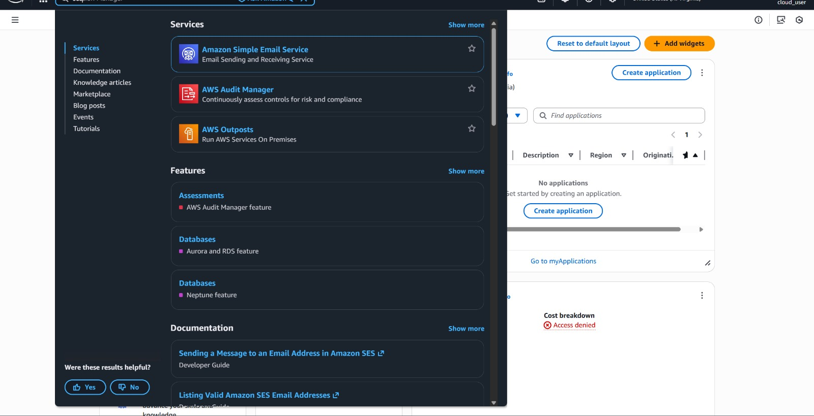
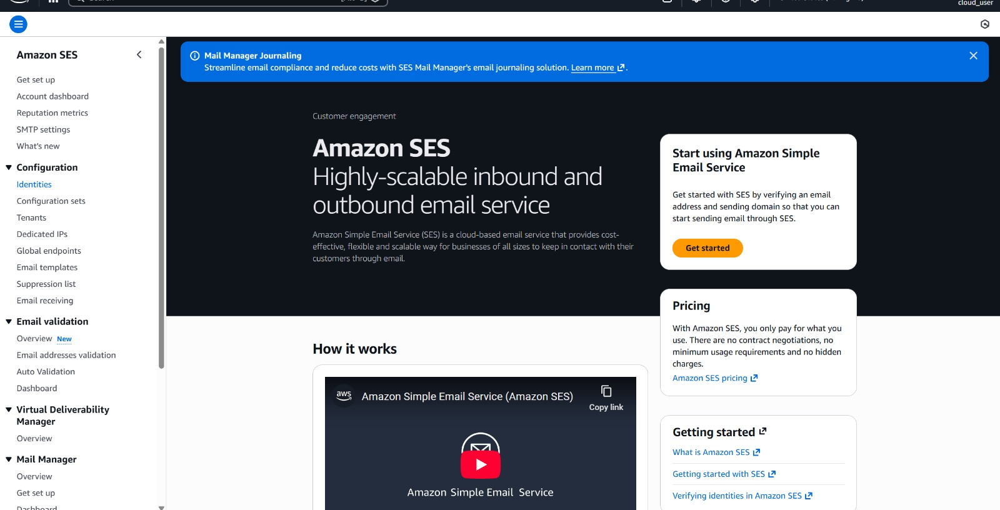

# AWS Email Reminder Lab

### Step 1: Login to AWS Console
- Logged in to AWS Management Console

### Step 2: Open Amazon SES
- Typed Simple Email Service in AWS search bar
- Clicked Amazon SES
- Confirmed region us-east-1

### Step 3: SES Console Home
- Opened Amazon SES console
- Viewed SES home dashboard
- Clicked Identities section from Configuration menu

